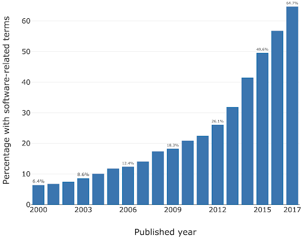
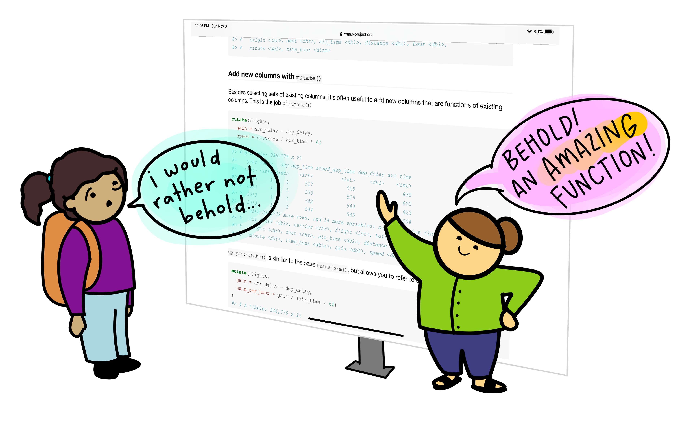

:::::::::::::::::::::::::::::::::::::: questions 

- Where does generative AI fit within the broader historical and technical landscape of AI systems?
- How do large language models generate text, code, or explanations without understanding meaning in a human sense?
- How can an AI coding assistant help development within an IDE?
- What are the mechanisms by which IDE AI assistants provide help?
- How should I sensibly and responsibly include AI coding assistants in my development workflow?
- What are the limitations of a free Copilot account?
- What is GitHub Copilot?
- Which AI models are available within Copilot?
- How do I make use of other third party or bespoke language models?

::::::::::::::::::::::::::::::::::::::::::::::::

::::::::::::::::::::::::::::::::::::: objectives

- Describe where ChatGPT and similar large language models fit within the broader AI landscape.
- Explain, at a conceptual level, what generative AI and ChatGPT are.
- Summarize the primary functions and intended use cases of common AI coding assistants.
- Describe some common tasks undertaken by an IDE coding assistant
- Describe a responsible approach to using IDE coding assistants in development
- Describe how GitHub Copilot integrates with Visual Studio Code
- Describe the different built-in models and their specialisms and tradeoffs
- Describe how to make use of other non built-in LLMs within Copilot
- List the limitations of the free pricing tier of GitHub Copilot

::::::::::::::::::::::::::::::::::::::::::::::::

## Introduction

Software is critical to research - the Software Sustainability Institute's UK Research Software Survey found that more than 92% of academics use research software, and 56% write their own code.
A study also conducted by the Institute also found an exponential increase in the prevalence of software-related terms in publications between 2000-2017.

As a specific institutional example, when researchers were asked "how important is research software to your work?" in a software study conducted at the University of Southampton, 73% of respondents indicated that it was "Vital".

For many researchers, writing code for data analysis or software development can be boring, frustrating, or intimidating. 
Most researchers would rather be thinking about and researching their subject matter rather than spending lots of time learning a programming language and writing code.
Therefore, with easy access to AI tools, it can be very tempting to ask AI to write your research code for you.

{alt='Cartoon of an instructor gesturing enthusiastically to a screen full of R documentation saying "BEHOLD! An amazing function!" A skeptical looking student looks on, saying "I would rather not behold...'}

This course aims to:

- Recap/provide a light introduction for how to use Microsoft Visual Studio Code
- Provide a working AI-supported environment within the Visual Studio Code Integrated Development Environment
- Demonstrate the fundamentals of how to use Copilot within Visual Studio Code to expedite research software development
- Introduce practical ways to mitigate the risks of using AI coding assistants within day-to-day software development

## Current Landscape of AI

In recent years, one particular type of AI system, generative AI, has dominated public and professional interaction with artificial intelligence. While highly visible, generative AI represents only one approach within a much broader AI landscape. 

At a high level, today’s AI systems can be grouped into three broad categories:

### 1. Rule-Based and Decision Systems

These systems operate using explicitly defined rules, logic, or constraints. Their behaviour is deterministic and transparent, which makes them reliable in stable, well-defined environments. Rule-based systems are still widely used in areas such as compliance, governance, and safety-critical decision-making. However, they are limited in their ability to handle ambiguity, novelty, or rapidly changing conditions.

A laboratory safety interlock is an example of a rule-based system. It monitors the state of critical variables, such as door positions, pressure levels, temperature, radiation shielding, or airflow, and allows an action only if all safety conditions are met. For example, a high-power laser system may be physically prevented from firing unless the enclosure door is closed, warning lights are active, and emergency stops are disengaged. If any condition is violated, the system immediately shuts down or blocks operation.

These systems are deterministic and transparent, in other words the same inputs always lead to the same outcome and the rules governing behaviour are explicitly defined. Unlike learning-based AI systems, laboratory safety interlocks do not adapt or infer, they exist to enforce safety rules reliably, even in the presence of human error.

### 2. Predictive and Analytical Systems

These systems learn patterns from data to make predictions, classifications, or risk estimates. Rather than following fixed rules, they use statistical models to answer questions such as 'What category does this belong to?' or 'How likely is this outcome?' Predictive AI systems are common in research and operational settings, including data analysis, diagnostics, and forecasting. Their outputs support decisions but do not create new content.

One example of a predictive AI system is a machine-learning model trained to automatically label features in microscope images, such as identifying specific cell types or structures.

The model learns from large sets of images that have been annotated by experts, using statistical patterns like shape, texture, and intensity to distinguish between categories. Once trained, it can rapidly classify new images, allowing researchers to analyse large datasets more efficiently and consistently than manual methods.

The system provides probabilities, rather than definitive answers, as outputs and does not generate new content or biological insight. The results must be validated and interpreted by researchers, as the model's performance depends heavily on the quality of the training data and imaging conditions.

{alt='Light micrograph of an undecalcified epiphyseal plate that is displaying the hypertrophic zone with its typical chondrocytes, matrix and three zones: maturation (top), degenerative (middle) and provisional calcification (bottom).'}

### 3. Generative Systems

Generative AI systems are designed to produce new outputs that resemble the data on which they were trained. This includes generating text, code, images, or other media. The current AI systems that we are familiar with, such as ChatGPT, fall into this category. These systems are optimised for producing fluent and contextually appropriate responses, not for verifying truth or making authoritative decisions.

Some examples of generative AI uses:

- The language learning app Duolingo uses generative AI to explain mistakes and practice conversations. The features are part of a new subscription tier called "Duolingo Max".
- The education website Khan Academy is using generative AI for their tutoring chatbot called "Khanmigo"
- An app called Be My Eyes helps people with visual impairments to identify objects and navigate their surroundings, by using the image recognition capabilities of GPT-4.

{alt='Smartphone with ChatGPT on the US dollar banknotes background'}

Most AI systems in use today are narrow, task-specific tools. Some are designed to enforce rules, others to analyse data and make predictions, and an increasingly visible group, generative systems, are designed to produce new content. Generative AI systems are powerful and influential, but they are not representative of AI as a whole. Hopefully, understanding these broad categories helps us to set appropriate expectations for AI and prepares us to examine generative AI in more detail.

| **AI System Type** | **What the system does** | **Strengths** | **Limitations** |
|-------------------|-------------------------|---------------|----------------|
| **Rule-Based & Decision Systems** | Follows clearly defined rules to allow, block, or trigger actions | Predictable and transparent; behaves the same way every time; well suited to safety-critical or regulated settings | Cannot adapt to new situations or handle uncertainty |
|  **Predictive & Analytical Systems** | Uses data to estimate categories, trends, or likelihoods | Can analyse large datasets efficiently; supports consistent analysis and forecasting | Results depend on data quality; outputs are probabilities, not final answers |
| **Generative Systems** | Creates new text, code, images, or other content | Flexible and easy to interact with; useful for drafting, coding, and exploring ideas | Outputs can sound confident but be incomplete or wrong |

**Human Oversight Across AI Types** 

Human responsibility increases from rule-based to predictive to generative systems because more judgment, interpretation, and accountability must be carried by people rather than the system itself. 

- Rule-based systems behave exactly as specified and therefore the responsibility is mostly in system design, not in day-to-day interpretation.
- Predictive systems give estimates, not decisions and the responsibility lies with humans for interpretation and validation.
- Generative systems require the highest human responsibility at the point of use.  For example, when a researcher uses generative AI to draft text, summarise literature, or generate code, the responsibility for correctness remains entirely with the human.

## Demystifying Generative AI

### What Is GPT?

The model of generative AI that has been widespread in recent years is GPT. An AI model that can produce text that reads as coherent and context-aware, such as explanations, summaries, or responses to questions.

ChatGPT is an application built on top of GPT models. It provides a user-friendly, conversational interface to interact with the GPT model. ChatGPT is one of many tools that use GPT. 

GPT is also integrated into software products such as Microsoft’s Copilot, search engines, and coding environments. 

GPT stands for Generative Pre-trained Transformer:

- **Generative**: GPT is designed to generate new content. Rather than retrieving fixed answers from a database, it produces original outputs, such as text or code.
- **Pre-trained**: it is trained on vast amounts of data before deployment.
- **Transformer**: this refers to the internal design of the neural network that helps the system keep track of context across longer pieces of text.

### Understanding Large Language Models

Systems like GPT belong to a group called Large Language Models (LLMs). An LLM is a program that learns how language works by analysing very large collections of text. It does not store facts in a database or follow pre-programmed rules. Instead, it learns patterns in how words, sentences, and ideas tend to appear together.

LLMs are built using neural networks. In this context, a neural network provides the underlying learning machinery that allows the system to absorb information from large amounts of text and improve its predictions over time.

::::::::::::::::::::::::::::::::::::: callout

## What is a neural network?

A neural network is a type of computational model inspired by how the human brain processes information. The name comes from its loose resemblance to brain cells (called neurons), but it is not a biological model of the brain.

Instead, a neural network is built from many simple processing units, called neurons, that pass information to one another in stages. Each neuron receives inputs, applies a simple rule to transform them, and then passes the result forward. By stacking many of these stages on top of each other, the system can learn complex patterns in data.

Learning in a neural network happens gradually as the network adjusts how strongly the neurons influence each other so that its outputs become more accurate over time.

{alt='Artificial neural network with layer coloring'}
 
{alt='Neuron and myelinated axon, with signal flow from inputs at dendrites to outputs at axon terminals.'}

::::::::::::::::::::::::::::::::::::::::::::::::

::::::::::::::::::::::::::::::::::::: callout

## What is a transformer?

A transformer is a type of neural network architecture designed specifically to work with sequences, such as sentences, paragraphs, or lines of code. Its key strength is the ability to consider context, that is, how different parts of a sequence relate to one another, when processing or generating information.

Traditional language-processing systems handled text one word at a time, in order. This made it difficult for them to keep track of long-range relationships, such as how a word at the start of a sentence relates to one at the end. Transformers address this limitation by processing all parts of a text sequence simultaneously, allowing the model to identify patterns and relationships across an entire passage at once.

The central mechanism that enables this is called attention. Attention allows the model to assign different levels of importance to different words in a sentence depending on the context. For example, when interpreting the meaning of a pronoun such as “it,” the transformer can look back across the sentence or paragraph to determine which earlier word is most relevant. This makes the model far more effective at handling complex language structures. For example, consider the sentence "The cat ate the mouse because it was hungry." Attention helps the model see that “it” refers to “the cat”, not “the mouse,” by focusing on the most relevant word in the sentence.

In practical terms, the transformer architecture is what enables systems like GPT to produce fluent, context-aware text, maintain coherence over long responses, and adapt their output to different tasks using the same underlying model. However, despite their apparent sophistication, transformers do not reason or understand language; they identify and reproduce patterns based on statistical relationships learned during training.

::::::::::::::::::::::::::::::::::::::::::::::::

GPT generates content **token by token**, rather than producing an entire sentence all at once. A token can be a word, part of a word, or a punctuation mark. 

This sequential token generation allows GPT to produce coherent and contextually relevant text because each new token is generated in the context of all previous tokens. It’s like writing a sentence one word at a time, making sure each word fits with everything written before it.

When you enter a prompt into GPT:

1. The model looks at the input text (the prompt) and splits it into tokens.
2. It predicts the probability of each possible next token based on all previous tokens.
3. A token is chosen based on the model’s predicted probabilities. Either the most likely token is selected, or one is sampled from the distribution of probable tokens to allow more varied or creative outputs.
4. The token is added to the growing output sequence.
5. Steps 2–4 repeat until the model produces a complete response.
6. The tokens are decoded back into human-readable text.

As you can now understand, GPT doesn't simply retrieve pre-written sentences, but instead builds content step by step and this is why it can generate such flexible and novel outputs. 

::::::::::::::::::::::::::::::::::::: callout

## What is a token?

A **token** is the basic unit of text that a GPT model processes and generates. Tokens are not always whole words. They may be a full word (e.g. `data`), part of a word (e.g. `clean` + `ed`), numbers, symbols, or punctuation (e.g. `.`, `,`, `(`).

Consider the sentence:

*“The dataset was cleaned.”*

Internally, the model might split this into tokens such as:`The`| ` data` | `set` | ` was` | ` clean` | `ed` | `.`

Large language models do not decide how to split words dynamically. Instead, tokenisation is fixed in advance by a tokeniser created before training. Most GPT-style models use subword tokenisation methods such as Byte Pair Encoding (BPE) or similar approaches, which merge frequently occurring character sequences until a fixed vocabulary size is reached.

Common words are typically single tokens (e.g. `data`), while less common or more complex words are split into subword tokens (e.g. `token` + `isation`). This allows the model to handle new or rare words by recombining familiar pieces rather than requiring a unique token for every word.

Tokens do not necessarily align with meaning or syllables because tokenisation is **statistical** rather than **linguistic**. This explains why prompts that seem similar to us humans can produce very different outputs. 

Understanding tokenisation allows us to appreciate a key limitation of GPT: the model optimises for what is **likely** to follow, not for what is **correct**, so early token-level errors can influence the rest of the response.

::::::::::::::::::::::::::::::::::::::::::::::::

### How a GPT Model is Trained

1. **Data collection** - A large amount of text is gathered to train the AI model on.
2. **Model architecture design** - The neural network architecture is designed to best suit the purpose of the AI
3. **Pre-training** - The AI model is trained on the collected text.
4. **Fine-tuning** - Further training the model on specific datasets and tasks related to its purpose e.g. if it is going to be a code assistant it will be trained on tasks related to code generation. 
5. **Alignment** – Guide the model so that its outputs are helpful, safe, and in line with human intentions. This often involves human feedback to encourage responses that are accurate, reliable, and appropriate.
6. **Evaluation and iteration** - Testing the AI in a variety of use cases, getting feedback and iterating the model architecture to improve performance. 

{alt='Diagram of the 6 steps for training a GPT model'}

## Overview of AI tools that can support research coding

### AI-Assisted Coding Tools

1. **ChatGPT** – A conversational large language model by OpenAI that can generate code, explain programming concepts, assist with debugging, and support data analysis workflows.

2. **GitHub Copilot** – AI-powered coding assistant integrated into code editors, suggesting code completions, functions, and boilerplate across multiple programming languages.

3. **Google Gemini** – Google’s AI platform for research and coding assistance, capable of generating code, providing explanations, and supporting data analysis and workflow tasks.

4. **Claude** – A conversational AI by Anthropic designed to assist with coding, writing, and research tasks, providing explanations, summaries, and code generation support.

5. **Microsoft Copilot** – Integrated into Microsoft tools like Word, Excel, and Visual Studio, this AI assistant helps with code generation, data analysis, and workflow automation.

Within the course, we'll be Copilot with a selection of its integrated AI models (ChatGPT and Claude) as the vehicles to illustrate the concepts and demonstrate how to use these tools.

### Levels of AI-Assisted Coding

The [Oxford AI Competency Centre](https://oerc.ox.ac.uk/ai-centre/ai-guides/getting-started-with-ai-for-coding) suggest thinking about AI-Assisted Coding as existing in four levels of differing complexity and capability:

**Level 1: Code Snippets (Copy and Paste)**
A Large Language Model inside a chatbot generates code that you copy and paste into files or environments you manage yourself. Examples: ChatGPT, Claude, Gemini, GitHub Copilot Chat

**Level 2: Canvas and Artifacts (Integrated Execution)** 
LLM writes code inside a chatbot and immediately runs it within the chat interface, creating interactive applications you can use and modify in real-time. Examples: Google Gemini, Claude Artifacts, ChatGPT Canvas

**Level 3: Agentic App Builders (Full Application Development)**
LLM-powered services that plan and execute the entire development process, from concept to deployed application, handling multiple files, frameworks, and deployment automatically. Examples: Lovable, Bolt, v0 by Vercel, Google AI Studio

**Level 4: Agentic IDEs (Professional Development)**
AI-powered development environments that assist with complex, multi-file projects, handling entire codebases, version control, and sophisticated development workflows. Examples: Cursor, GitHub Copilot, Claude Code, Google Colab

This intermediate course addresses working within Level 4,
using Microsoft Visual Studio Code (VSCode) and Copilot.

::::::::::::::::::::::::::::::::::::: callout

## Which tools are most commonly used by researchers?

In a study of 868 scientists who code as part of their research, ChatGPT was by far the most common tool used to assist with research coding, used by 64% of participants, followed by GitHub Copilot, used by 12% of participants. 

*(O'Brien, G., Parker, A., Eisty, N., & Carver, J. (2025). More code, less validation: Risk factors for over-reliance on AI coding tools among scientists. arXiv preprint arXiv:2512.19644.)*

::::::::::::::::::::::::::::::::::::::::::::::::

## Using AI Coding Assistants in Integrated Development Environments (IDEs)

Generative AI has the potential to transform how researchers work with code,
and with the integration of such capability within common IDEs, such as Visual Studio Code,
provide the coding researcher with powerful tools to modify, expand and otherwise work with code.
But this potential needs to be tempered with critical thinking and a healthy degree of skepticism.

{alt="Photo of Python code within an IDE"}

### Common Tasks and Features

AI coding assistants in IDEs (such as GitHub Copilot) provide a bewildering array of support for various tasks, including:

- **Code explanation** – explains how existing code works, helping researchers understand unfamiliar code or learn new programming patterns
- **Code completion and generation** – suggests and generates code snippets based on context, reducing time spent on boilerplate and repetitive code
- **Function and method suggestions** – proposes complete function implementations based on function signatures and docstrings
- **Debugging assistance** – identifies potential bugs and suggests fixes for problematic code
- **Documentation generation** – automatically generates comments, docstrings, and README content
- **Refactoring support** – suggestions for improving code structure and readability
- **Test generation** – creates unit tests for existing code to improve code reliability
- **Language/framework translation** – converts code between programming languages and frameworks
- **Designing and planning new code** – helps structure projects and write new functionality by generating code based on high-level descriptions, function signatures, and requirements; can create initial implementations that developers then refine

### Benefits and Risks

AI coding assistants offer several key benefits to research software development.
They can accelerate development by reducing time spent on routine coding tasks, allowing researchers to focus on domain-specific problems.
Plus, for those new to a programming language, these tools help lower the learning curve and enable faster productivity.
The suggestions and examples provided by AI assistants *may* also encourage better coding practices and improve overall code quality.
Additionally, they make it easier to maintain clear and comprehensive documentation, supporting long-term code maintainability.

However, they also introduce a number of significant risks:

- **Correctness and Validation** - generative systems optimize for likelihood, not correctness. AI-generated code can sound confident but be incomplete, incorrect, or insecure. Researchers remain fully responsible for validating outputs.
- **Limited explanation** - unlike a standalone AI like ChatGPT, IDE-integrated AI often provides suggestions without detailed reasoning. This can reduce researchers’ understanding of AI-generated code
- **Potential over-reliance** - it can be very tempting to accept AI code suggestions that appear to work, without fully understanding them, and this can lead to errors or misunderstandings about what your code does.
- **Privacy and security risks** - the AI may send code snippets to cloud services for processing. Sensitive data or unpublished research could be exposed if this is not carefully managed.
- **Context and Edge Cases** – AI assistants may miss domain-specific requirements, edge cases, or research-specific constraints that are critical for correctness.
- **Code Quality** - generated code may work but be inefficient, poorly structured, or violate best practices, degrading long-term 
maintainability.

There are also a number of tangential non-coding risks we should consider.
One of these is vendor lock-in: as the perceived value of a particular vendor's AI tool increases, so does the risk of dependence on that particular vendor's tool.
This can make switching tools difficult and leaving users at greater risk of service price increases and at the mercy of that vendor's product roadmap, which may not align with the goals of the user.
Secondly, depending on the training data used (e.g. codebases, best practice articles, etc.), biases may be introduced that favour particular technical tools and approaches which are not optimal or even sensible choices for a project. Plus, even [Microsoft acknowledges](https://support.microsoft.com/en-gb/topic/transparency-note-for-microsoft-copilot-c1541cad-8bb4-410a-954c-07225892dbc2) that *"The language, image, and audio models that underly the Copilot experience may include training data that can reflect societal biases, which in turn can potentially cause Copilot to behave in ways that are perceived as unfair, unreliable, or offensive."*
These may include the reinforcing of negative stereotypes, over or under-representation of specific groups of people, even inappropriate or offensive content, and variable performance across different spoken languages.

Research software produces results that inform publications, policy, and further research.
Unlike commercial software where bugs typically cause inconvenience, errors in research code can invalidate findings, waste resources, introduce unwanted biases, and compromise scientific integrity.
AI tools optimize for likelihood, not correctness, so again, as responsible researchers,
we must scrutinise AI generative responses.

### A Key Risk: Technical Debt

When faced with a problem that you need to solve by writing code,
it may be tempting to skip the design phase and dive straight into coding,
particularly when we have AI-assistants able to generate code so comprehensively and rapidly,
with such an array of features.

Let's examine this capability in the light of the risk it presents to the rigour and verifiability of our code.

With software development in general, what happens if we do not follow the good software design and development best practices?
It can lead to accumulated 'technical debt',
which (according to [Wikipedia](https://en.wikipedia.org/wiki/Technical_debt)),
is the "cost of additional rework caused by choosing an easy (limited) solution now
instead of using a better approach that would take longer".
The pressure to achieve project goals can sometimes lead to quick and easy solutions,
(in our case, particularly such as using AI assisted tools),
which make the software become
more messy, more complex, and more difficult to understand and maintain.

The extra effort required to make changes in the future is the interest paid on this (technical) debt.
It is natural for software to accrue some technical debt,
but it is important to pay off that debt during a maintenance phase -
simplifying, clarifying the code, making it easier to understand -
to keep these interest payments on making changes manageable.

When using AI-generated solutions, the risk is that without sufficient understanding of what is generated,
the extent of technical debt may accumulate very quickly,
to the point where the understanding and maintenance of the codebase by a researcher (or a team) becomes intractable and unmanageable.
So we need to integrate the use of AI tooling responsibly within our day-to-day development practices.

### The Immature and Rapidly Evolving Landscape

While AI coding assistants in IDEs present features that may appear advanced and polished, the field itself remains relatively immature and is evolving at a rapid pace. The landscape is characterized by:

- **Rapid feature development** - new capabilities are continuously being added and refined by vendors competing in this space
- **Unstable implementations** - how features are implemented, displayed, and accessed changes frequently, sometimes between minor version updates
- **Shifting vendor priorities** - large technology companies regularly adjust their AI strategies.
For example, Microsoft has recently scaled back some of its ambitious AI goals for Visual Studio Code, which may affect the availability and priority of AI-assisted features in the editor
- **Incomplete standardization** - there is no industry-wide standard for how AI assistants should integrate with IDEs, leading to inconsistent user experiences across different tools

This rapid evolution means that the tools and best practices applied to them can quickly become outdated.
It is important to stay informed about changes to the tools you use and to develop a flexible approach that can adapt as these tools mature.

## Introduction to GitHub Copilot

### Different Models

## References

- [S.J. Hettrick et al, UK Research Software Survey 2014](https://zenodo.org/records/1183562)
- [S.J. Hettrick, It's Impossible to Conduct Research Without Software, Say 7 out of 10 UK Researchers](http://www.software.ac.uk/blog/2014-12-04-its-impossible-conduct-research-without-software-say-7-out-10-uk-researchers)
- [S.J Hettrick et al, An investigation of the funding invested into software-reliant research"](https://github.com/softwaresaved/software_in_grants_GTR)
- [Introduction to Generative AI for Researchers](https://www.lse.ac.uk/DSI/AI/AI-Research/Introduction-to-Generative-AI-for-researchers?entryId=2319c173-7bdc-45d3-9a69-d12fd54340d7&nodeId=e2e64854-5d30-44fa-a289-a5ef76104f3e)
- [O'Brien, G., Parker, A., Eisty, N., & Carver, J. (2025). More code, less validation: Risk factors for over-reliance on AI coding tools among scientists.](https://arxiv.org/abs/2512.19644)
- [Getting started with AI for Coding by Oxford AI Competency Centre](https://oerc.ox.ac.uk/ai-centre/ai-guides/getting-started-with-ai-for-coding)

::::::::::::::::::::::::::::::::::::: keypoints 

- Artificial intelligence is not as a single capability or system, but as a broad collection of techniques and approaches for solving different kinds of problems.
- AI can be grouped into 3 broad categories: Rule-Based and Decision Systems, Predictive and Analytical Systems, and Generate Systems
- GPT (Generative Pre-trained Transformer) is a type of large language model built on transformer neural networks, which use attention to process entire sequences and capture context, enabling coherent, context-aware text or code generation.
- GPT generates content one token at a time, predicting each new token based on all previous tokens to produce fluent, contextually relevant, and novel outputs.
- GPT models are trained in stages: collecting large text datasets, designing the neural network, pre-training on broad data, fine-tuning on task-specific datasets, and iteratively evaluating and improving performance.
- ChatGPT is a user-friendly application built on GPT models, while GPT itself is also integrated into other tools like Microsoft Copilot, search engines, and coding environments.
- Technical debt accumulates when skipping design phases for quick AI-generated solutions, requiring future maintenance effort to simplify and clarify code.

::::::::::::::::::::::::::::::::::::::::::::::::
