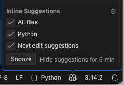
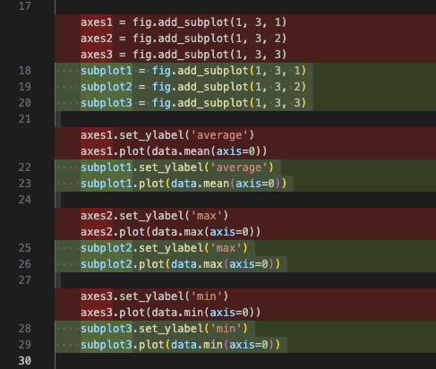

:::::::::::::::::::::::::::::::::::::: questions 

- How can Copilot help me improve my code?
- What can I do to improve my Copilot prompts?
- How can I reuse previous Copilot prompts?

::::::::::::::::::::::::::::::::::::::::::::::::

::::::::::::::::::::::::::::::::::::: objectives

- Describe how to use prompt engineering to obtain valuable responses from Copilot
- Use Copilot to improve a segment of code
- Use Copilot to add a new, small feature to an existing codebase
- Describe how to use Copilot to assist with Git commit messages
- Create and use a reusable prompt context

::::::::::::::::::::::::::::::::::::::::::::::::

In the previous episode we looked at Copilot giving us guidance and advice to improve our code.
In this episode, we'll look at how Copilot can assist with code modifications more directly,
looking at the following features:

- `Inline suggestions` - where Copilot provides coding suggestions as you type
- `Edit mode` - where Copilot provides broad suggestions (like `Ask` mode) but will also enact them step-by-step directly on our approval
- `Agent mode` - where Copilot directly autonomously undertakes large scale changes, with a single option to approve the changes at the end of the process

These are in ascending order of the autonomy, authority and scope that we delegate to Copilot to make changes.
As we'll see, as we delegate more authority and scope,
the more we should increase our skepticism and diligence in reviewing and understanding suggestions made by such tools.

## Inline Suggestions

Within VSCode, Copilot can provide "inline" suggestions as we type,
which go much further than typical IDE autocomplete suggestions.

If we select the Copilot icon again in the status bar,
we can see the current inline settings:



So here, we can see that inline settings will apply to all Python files.
These suggestions will appear as "ghosted text" suggestion which you can autocomplete with tab,
very similar to how they appear with standard VSCode autocomplete.
There are also `Next edit suggestions` which go beyond the immediate context to make suggestions in other places in your code.
These predict the location and the content of the next edit you'll want to make.

Let's say we want to add a new section describing our coding style.
Add the following at the bottom of the file:

```markdown
## Coding Style
- 
```

You should see a suggestion appear direcly after your cursor,
something like `Use PEP 8 style guidelines for Python code`, `Use descriptive variable names (e.g., data, mean_plot, max_plot, min_plot)` or similar.
You can accept this suggestion by pressing `Tab`.
If you continue to add new lines after this, you may find it continues to suggest other things to include,
so we end up with, for example:

```markdown
### Coding Style
- Use descriptive variable names (e.g., `inflammation_data`, `mean_inflammation`)
- Follow PEP 8 for formatting (indentation, spacing)
- Comment code sections for clarity, especially data processing steps
```

It does this by rapidly incorporating contextual information from a number of sources to infer a suggestion,
including:

- The code file you are editing
- Any code you have currently selected
- Frameworks, languages and dependencies
- Any instructions file

Copilot suggestions are a starting point, but we should alwyays review, understand, and amend as necessary,
as opposed to blindly accepting suggestions.

:::::::::::::::::::::::::::::::::::::: challenge

## Amend the Suggestions

3 mins.

Read through and understand the Copilot suggestions for the Coding Style section of the `copilot-instructions.md` file,
and add/amend as you see fit, perhaps to fit your coding style.

:::::::::::::::::::::::::: solution

For example:

```markdown
### Coding Style
- Follow PEP 8 style guidelines for Python code
- Use descriptive variable names (e.g., `inflammation_data`, `mean_inflammation`)
- Comment code sections for clarity, especially to explain purpose and logic, and to describe data processing steps
```

As we'll see shortly, these coding style guidelines will inform future refactoring of our code.

:::::::::::::::::::::::::::::::::::

::::::::::::::::::::::::::::::::::::::::::::::::

:::::::::::::::::::::::::::::::::::::: challenge

## Inline Suggestions for Code

3 mins.

In `inflammation-plot.py`, begin adding an additional parameter to the functions calls in the code,
by placing an additional `, ` at the end of the given list of parameters, and see which inline suggestions are being made, e.g.:

```python
    data = np.loadtxt(fname=filename, delimiter=',', ... )
```

Try this for the following function calls:
- `np.loadtxt`
- `plt.figure`
- Each of the `.plot` calls to the `axes` variables

1. What's being suggested?
1. Are the suggestions helpful? Are they always the same?
1. Does the code run as you expect?

:::::::::::::::::::::::::: solution

1. For example:

```python
    data = np.loadtxt(fname=filename, delimiter=',', dtype=np.float64)
```

```python
    fig = plt.figure(figsize=(10.0, 3.0), dpi=100)
```

For `.plot`, if the first suggestion of a `color` parameter is selected,
it suggests variants of that for the other calls to `plot`, e.g.

```python
    axes1.plot(data.mean(axis=0), color='blue')
    axes2.plot(data.mean(axis=0), color='red')
    axes3.plot(data.mean(axis=0), color='green')
```

:::::::::::::::::::::::::::::::::::

:::::::::::::::::::::::::: solution
:::::::::::::::::::::::::::::::::::

::::::::::::::::::::::::::::::::::::::::::::::::

## Agent Mode: Small Changes

Agent mode differs from inline suggestions by offering the ability to enact changes step-by-step directly on your approval.
Unlike inline suggestions which appear as you type, this mode allows you to request broader changes across multiple lines or functions,
so it's ideal for repetive things like small-scale refactoring of code logic or renaming variables.
It represents a middle ground in terms of autonomy — more direct than inline suggestions but less autonomous than Plan mode.

To get started with using Copilot to make a small edit, you highlight the code you want to modify before requesting the change you want.

For example:

1. Select `+` to create a new chat conversation
1. Select `inflammation-plot.py` in the chat context
1. Select `Ask` as the Copilot mode in the chat window
1. Select a model of your choice
1. Select the entire for loop in `inflammation-plot.py`; you'll notice that the context now includes this file with the selected line numbers
1. Enter `Add a comment about this code above this loop`
1. Press `Enter`

You'll now see a comment added above the loop highlighted in green, e.g.

```python
# Process each inflammation data file and generate a 3-panel visualization
# showing the mean, maximum, and minimum inflammation values across patients
```

You'll also see a `Keep` or `Undo` pop-up displayed at the bottom.
Read through the comment, and if you agree that the comment summarises the code sufficiently, select `Keep`.

::::::::::::::::::::::::::::::::: callout

## The Temptation to Blindly Accept!

So note that here, we properly scrutinise the suggestion as opposed to accepting it blindly!
it would be all too easy to just assume it's correct and just accept it,
but it's helpful to remember that tools like Copilot are like a more helpful autocomplete,
not a thinking teammate.
As such, skepticism and review must become a key practice when using such tools.

:::::::::::::::::::::::::::::::::::::::::

### Copilot and Commit Messages

What's also useful is that we can have Copilot draft Git commit messages for us too.
Sometimes writing concise messages is a bit of a pain, and this can help shortcut this activity a bit.
It's also useful as an indicator of the scope of what we've changed semantically,
although since Copilot aims to be concise, it may miss some key details.

Let's add the changes we've made so far to the Git staging area:

1. Select `Source Control` in the navigation bar (the third one down)
1. Select the `+` icon next to `inflammation-plot.py` in the `Changes` list, which will add our changes so far to the Git staging area
1. Select the sparkle icon next to the `Message` text box

You should see something like:

`Enhance inflammation plot visualization by adding colors and specifying data type`

Of course, we should vet and edit (or ask Copilot to retry) this description accordingly.
In this case, it doesn't mention about the DPI setting which might be a particular nuance we wish to add,
so again, we need to review what Copilot suggests.

Also worth noting is that if we wanted to reference a repository issue number in our commit message,
we should remember to add that as well.

Once we're happy with it, we can then select `Commit` to commit our changes to our local repository.

:::::::::::::::::::::::::::::::::::::: challenge

## A Small Refactor!

3 mins.

Let's assume we want to rename the `axes` variables to have the prefix `subplot` instead,
e.g. instead of `axes1`, we'd have `subplot1`.

Use Copilot agent mode to rename all of these variables,
then verify and accept the changes if you agree with them.
Does the code still run correctly?

Note: after selecting the code, you can also request edits by typing `Ctrl` + `I` (Linux) or `Cmd Key/Windows Key` + `I` (Mac/Windows) to have a small pop-up appear to type in your request,
which is quicker and sometimes more convenient if it's a small request.

:::::::::::::::::::::::::: solution

1. Select the code from the first `axes1` definition to the last use of `subplot3`, e.g.

   ```python
       axes1 = fig.add_subplot(1, 3, 1)
       axes2 = fig.add_subplot(1, 3, 2)
       axes3 = fig.add_subplot(1, 3, 3)

       axes1.set_ylabel('average')
       axes1.plot(data.mean(axis=0))

       axes2.set_ylabel('max')
       axes2.plot(data.max(axis=0))

       axes3.set_ylabel('min')
       axes3.plot(data.min(axis=0))
   ```

1. Ensure `Agent` mode is selected in chat, and enter `Rename axes variables to have a subplot prefix instead`
1. Press `Enter` and you should see something like the following:
   
1. After reviewing the suggestions, select `Keep`

The code still runs correctly.

:::::::::::::::::::::::::::::::::::

::::::::::::::::::::::::::::::::::::::::::::::::


## Agent Mode: Larger-scale Changes

We can also ask Copilot in agent mode to make much larger, potentially multi-file changes across our codebase.
So instead of asking Copilot to change a specific piece of code, you give it a goal, such as adding a feature, or refactoring a module.
Copilot then plans how to achieve that goal and works across the repository to do so.
It may read and modify multiple files, add or update tests, adjust configuration, and iterate over several steps before presenting the result.
In this way, agent mode behaves more like a junior developer taking on a task, rather than a pair programmer responding line-by-line.

Note the increase in authority to modify code, which represents a much greater risk:
the impact of changes is greater and requires more careful (and potentially more involved) review.

In the last episode we looked at the suggestions made by two Copilot models to improve the code.
Let's now use agent mode to do this as a refactoring activity,
directly amending our code with the goal to improve its readability.

1. Select `+` to create a new chat conversation
1. Select `inflammation-plot.py` in the chat context
1. Set Copilot's mode to `Agent`
1. Select a model you'd like to use
1. Enter the following prompt: `Refactor this code to improve it's modularity and readability`
1. Press `Enter`
1. Once suggested improvements appear, review the changes and either:
   - If you agree with them and think they are an improvement on the original code, `Keep` the suggestions
   - If you don't agree with them, cancel the suggestions and select the circular `Retry` icon at the bottom left of the chat response until you get something more acceptable

One example of output:

```python
"""
Analyze and visualize inflammation data.

This script reads inflammation CSV files from data/, computes statistics
(mean, max, min) across patients for each day, and saves corresponding
plots as PNG files.
"""

import glob
from pathlib import Path

import numpy as np
from matplotlib import pyplot as plt


def load_inflammation_data(filename: str) -> np.ndarray:
    """Load inflammation data from a CSV file.
    
    Args:
        filename: Path to the CSV file containing inflammation data.
        
    Returns:
        A 2D numpy array where rows are patients and columns are days.
    """
    return np.loadtxt(fname=filename, delimiter=',')


def create_statistics_plot(data: np.ndarray, figure_size: tuple = (10.0, 3.0)) -> plt.Figure:
    """Create a figure with three subplots showing mean, max, and min values.
    
    Args:
        data: A 2D numpy array of inflammation values.
        figure_size: Tuple of (width, height) for the figure in inches.
        
    Returns:
        The matplotlib Figure object containing the three subplots.
    """
    fig = plt.figure(figsize=figure_size)
    
    # Create subplots for mean, max, and min statistics
    subplots = [fig.add_subplot(1, 3, i) for i in range(1, 4)]
    
    statistics = [
        ('average', data.mean(axis=0)),
        ('max', data.max(axis=0)),
        ('min', data.min(axis=0)),
    ]
    
    for subplot, (label, values) in zip(subplots, statistics):
        subplot.set_ylabel(label)
        subplot.plot(values)
    
    fig.tight_layout()
    return fig


def process_inflammation_file(filename: str) -> None:
    """Load inflammation data and save a statistics plot.
    
    Args:
        filename: Path to the CSV file to process.
    """
    print(filename)
    data = load_inflammation_data(filename)
    fig = create_statistics_plot(data)
    output_filename = f"{filename}.png"
    fig.savefig(output_filename)
    plt.close(fig)


def main() -> None:
    """Load and process all inflammation data files."""
    filenames = sorted(glob.glob('data/inflammation-*.csv'))
    for filename in filenames:
        process_inflammation_file(filename)


if __name__ == '__main__':
    main()
```

So in this instance, we can see that there are a whole swathe of changes:

- Modularised the codebase by refactoring into four functions: use of a main function called from the top-level script, for loading a CSV file, generating a plot for a set of data, and processing a particular inflammation file
- Docstrings have been added for each of the functions and the module
- The processing of the average, maximum and minimum values has been refactored into a loop iterating over a data structure
- The subplots are generated within a loop using `zip()` to provide corresponding pairs of array elements into the loop.
If we didn't like this particular style, we might use Edit mode on this segment to simplify it

Note that it differs substantially from the version shown from a similar question made in Ask mode earlier,
and whilst it is more modular,
it's now 127 lines of code where before it was 32 lines - 
we might consider this to be quite an over-engineered overkill.


::::::::::::::::::::::::::::::::: callout

## What if I don't get a Good Response?

If you aren't getting a good response despite retrying several times,
it suggests that the prompt is either not reflective of what you're really after or isn't specific enough,
so try amending the request.

:::::::::::::::::::::::::::::::::::::::::

Now once the suggestions have been integrated,
we're still able to undo these changes, e.g. either by selecting `Edit` and `Undo` from the VSCode menu,
or pressing `Ctrl + Z` (or `Cmd/Windows Key + Z`).
We're also able to edit a previous prompt in the chat window,
perhaps adding more specifics for what we want.

:::::::::::::::::::::::::::::::::::::: challenge

## A Large Refactor!

5 mins.

Perhaps the suggestions look generally quite good,
but maybe it isn't quite what we're after.

Select `Edit` and then `Undo` from the VSCode menu to undo the recent changes.

Edit the agent mode prompt in the chat (using a model of your choice) to include more specificity in the request, for example:

- `Refactor this code to improve its modularity and readability, using the reST format for docstrings`
- `Refactor this code to improve its modularity and readability, and easy to understand for a novice coder`

You might want to `Retry` or amend your prompt a few times to obtain something you find acceptable!

:::::::::::::::::::::::::: solution

For the second prompt above, for example (note the increased level of commenting, more descriptive docstrings,
and less complex coding patterns for data processing and generating the plots):

```python
"""
Inflammation Data Visualization Script

This script processes inflammation data from CSV files and creates visualizations
showing average, maximum, and minimum inflammation levels across patients for each day.
"""

import glob
import numpy as np
from matplotlib import pyplot as plt


def load_inflammation_data(filepath):
    """
    Load inflammation data from a CSV file.

    Args:
        filepath (str): Path to the CSV file to load

    Returns:
        np.ndarray: 2D array of inflammation data (rows=patients, columns=days)
    """
    data = np.loadtxt(fname=filepath, delimiter=',')
    return data


def create_statistics_figure(data):
    """
    Create a figure with three subplots showing statistics of inflammation data.

    Args:
        data (np.ndarray): 2D array of inflammation data

    Returns:
        tuple: (figure object, list of subplot axes)
    """
    # Create figure with three subplots side by side
    fig = plt.figure(figsize=(10.0, 3.0))

    # Create three subplots for average, max, and min
    subplots = [
        fig.add_subplot(1, 3, 1),
        fig.add_subplot(1, 3, 2),
        fig.add_subplot(1, 3, 3),
    ]

    return fig, subplots


def plot_statistics(subplots, data):
    """
    Plot average, maximum, and minimum statistics on the given subplots.

    Args:
        subplots (list): List of matplotlib axes objects
        data (np.ndarray): 2D array of inflammation data
    """
    # Calculate statistics across all patients (axis=0)
    average = data.mean(axis=0)
    maximum = data.max(axis=0)
    minimum = data.min(axis=0)

    # Plot average on first subplot
    subplots[0].set_ylabel('average')
    subplots[0].plot(average)

    # Plot maximum on second subplot
    subplots[1].set_ylabel('max')
    subplots[1].plot(maximum)

    # Plot minimum on third subplot
    subplots[2].set_ylabel('min')
    subplots[2].plot(minimum)


def save_figure(figure, filename):
    """
    Save a matplotlib figure as a PNG file.

    Args:
        figure: matplotlib figure object
        filename (str): Output filename (will add .png extension)
    """
    output_filename = filename + '.png'
    figure.savefig(output_filename)
    print(f"Saved visualization: {output_filename}")


def process_inflammation_files(data_directory='data/inflammation-*.csv'):
    """
    Process all inflammation CSV files and create visualizations.

    This function:
    1. Finds all CSV files matching the pattern
    2. Loads data from each file
    3. Creates a figure with statistical plots
    4. Saves the figure as a PNG file

    Args:
        data_directory (str): Glob pattern for finding CSV files
    """
    # Find all inflammation CSV files
    filenames = sorted(glob.glob(data_directory))

    # Process each file
    for filename in filenames:
        print(f"Processing: {filename}")

        # Load data from file
        data = load_inflammation_data(filename)

        # Create figure with subplots
        fig, subplots = create_statistics_figure(data)

        # Plot statistics on the subplots
        plot_statistics(subplots, data)

        # Arrange subplots so labels don't overlap
        fig.tight_layout()

        # Save figure as PNG file
        save_figure(fig, filename)


# Main execution
if __name__ == '__main__':
    process_inflammation_files()
```

:::::::::::::::::::::::::::::::::::

::::::::::::::::::::::::::::::::::::::::::::::::

:::::::::::::::::::::::::: instructor

## Quick Check: Ask the Audience

Following the exercise, paste the following comment into the chat, and ask for thumbs up/down as a reaction to it,
and summarise the responses:

Were you able to achieve something that you regard as well written code that you understand and runs?

:::::::::::::::::::::::::::::::::::::

:::::::::::::::::::::::::::::::::::::: challenge

## A "Clever" Refactor!

5 mins.

Let's assume that we want to expand this codebase further.
Perhaps we know that the inflammation data format will change in the future,
in ways that mean the NumPy library isn't the ideal processing library of choice,
and that the Pandas library (which is a more general purpose data analysis library) will be a much better fit for this work.

Using agent mode and a model of your choice,
ask Copilot to refactor your code to use Pandas instead of NumPy:

Part 1:

1. Construct and enter a suitable prompt
1. Review and accept the changes
1. What do you need to do to be able to re-run the code?
1. Does the code generate the correct results?
1. Add the changes to Git staging area, Ask Copilot to generate a commit message, amend as necessary, and commit the change

Part 2:

- If you already know Pandas, do the changes look sensible?
- If you don't know Pandas, what are the risks of accepting these changes?

:::::::::::::::::::::::::: solution

Part 1:

Prompt: `Modify this code to use Pandas instead of NumPy`

In order to run it, we also need to add pandas library to the virtual environment.
In a terminal:

```bash
python -m pip install pandas
```

:::::::::::::::::::::::::::::::::::

:::::::::::::::::::::::::: solution

Part 2:

If you don't already know Pandas,
there is a considerable risk with this type of refactoring:
by accepting these modifications,
we're including code without understanding the concepts or operations of Pandas.
This greatly increases the risk that we generate incorrect code,
and should be avoided.

:::::::::::::::::::::::::::::::::::

::::::::::::::::::::::::::::::::::::::::::::::::


:::::::::::::::::::::::::::::::::::::: challenge

## Another Plot Please

3 mins.

Use agent mode to add the generation of a fourth plot to the code,
for standard deviation,
test the code to ensure it works,
then add and commit the changes with a Copilot-generated (and reviewed) commit message.

:::::::::::::::::::::::::: solution

Prompt: `Add a fourth axes plot for standard deviation`

```python
    fig = plt.figure(figsize=(13.0, 3.0), dpi=100)

    axes1 = fig.add_subplot(1, 4, 1)
    axes2 = fig.add_subplot(1, 4, 2)
    axes3 = fig.add_subplot(1, 4, 3)
    axes4 = fig.add_subplot(1, 4, 4)

    axes1.set_ylabel('average')
    axes1.plot(data.mean(axis=0), color='blue')

    axes2.set_ylabel('max')
    axes2.plot(data.max(axis=0), color='red')

    axes3.set_ylabel('min')
    axes3.plot(data.min(axis=0), color='green')

    axes4.set_ylabel('std')
    axes4.plot(data.std(axis=0), color='orange')
```

:::::::::::::::::::::::::::::::::::

::::::::::::::::::::::::::::::::::::::::::::::::

:::::::::::::::::::::::::: instructor

For the next exercise, in the shared notes document have a section for participants to add in answers.

:::::::::::::::::::::::::::::::::::::

:::::::::::::::::::::::::::::::::::::: challenge

## Class Discussion: What Will *You* Change?

5 mins.

How do you see AI coding assistants like Copilot changing your working practices?

::::::::::::::::::::::::::::::::::::::::::::::::

::::::::::::::::::::::::::::::::: callout

## The Importance of Process

Process - the way we do things - is important in software engineering because it’s what leads towards reliable outcomes.
Without process we rely on tacit knowledge and luck.
But with process, we get repeatability, shared understanding, and the ability to improve over time.
Good process makes work visible, enforces quality at the right moments (design, review, testing, release),
and creates feedback loops so mistakes are caught early, when they’re cheapest to fix.
In science, reproducibility is a central tenet of research.
So as responsible researchers, we need to ensure we apply the same rigour to the software we write.

AI tools like Copilot make this more important, not less.
Whilst it accelerates code generation, it doesn't understand intent or consequences,
so a strong process ensures we use AI in an environment that amplifies good engineering habits instead of bypassing them.
The key principle is that process assigns responsibility to people, not tools.
Copilot speeds up execution, but process ensures accountability, quality, and sustainability.

:::::::::::::::::::::::::::::::::::::::::

:::::::::::::::::::::::::: instructor

For the next exercise, in the shared notes document have a section for participants to add in answers.

:::::::::::::::::::::::::::::::::::::

:::::::::::::::::::::::::::::::::::::: challenge

## Class Discussion: How Should we Mitigate The Risks of using AI Coding Tools?

5 mins.

What can we do to mitigate the risks of using AI coding tools like Copilot?
How should we adapt our day-to-day development to accommodate these changes,
not only for we use such tools with code, but also with our data?

:::::::::::::::::::::::::: solution

Some suggestions:

- Ensure suggested changes are throughly reviewed understood prior to their inclusion in the code
- Keep the context and scope of prompts (and their expression) to a minimum to accomplish a task,
to discourage large and/or complex suggestions that are difficult to understand
- In the case of refactored code, ensure suggested changes are throughly tested against the original version to ensure correct behaviour, i.e. manually, but also re-running a unit test suite if one exists and includes sufficient tests for the modified code
- Consider adding unit tests for AI-suggested changes or new features
- Ensure we continue to adhere to any project defined data management plan and institutional research data management policies

Note that many of these changes are accepted best practice for code written manually.
However since much less of our own cognition is involved in this style of development,
adopting a more critical and skeptical approach becomes even more important.

:::::::::::::::::::::::::::::::::::

::::::::::::::::::::::::::::::::::::::::::::::::

## Reusable Code Prompts

Reusable prompts in VSCode Copilot are predefined instructions or templates that you can quickly insert and use to guide Copilot's code generation or assistance.
These prompts help you standardize requests, save time, and ensure consistency when working on repetitive tasks or when you want Copilot to follow specific patterns.

### How Reusable Prompts Work

You can create reusable prompts by saving frequently used instructions or code templates.
These can be stored as snippets, comments, or in dedicated prompt files, depending on your workflow and the Copilot extension features.

When you need Copilot to perform a task, you can insert a reusable prompt into your code or command palette.
Copilot will interpret the prompt and generate code or suggestions based on the provided context.

Reusable prompts help you:
- Speed up development by avoiding repetitive typing
- Maintain consistency in code style and structure
- Share best practices and prompt templates with your team

Common reusable prompts include requests like "Write a function to...", "Add type annotations to...", or "Generate unit tests for...".
We then have the option to adapt these to our specific project needs.

Some Copilot extensions or plugins may offer enhanced support for managing and sharing reusable prompts, making it easier to organize and access them within VSCode.

Let's create a reusable prompt now.
Our code repository is currently lacking a README, so let's adapt a pre-existing prompt definition.
There are many reusable and freely available Copilot resources at [Awesome GitHub Copilot](https://github.github.com/awesome-copilot/),
including agents, reusable prompts, and instruction files, all available from a GitHub repository.

Let's first obtain a reusable prompt for generating README files.
Take a look at https://raw.githubusercontent.com/github/awesome-copilot/refs/heads/main/prompts/readme-blueprint-generator.prompt.md:

Looking at the file, we can see a number of structural features:

- A metadata header at the top, describing what it aims to do and how it will run (in this case, via an agent)
- A sequence of steps to follow, in this case starting with scanning a certain set of files to build context, using any `copilot-instructions.md` file, and generating a sections each based on specific criteria
- Some end instructions clarifying how to format the README, and some high-level guidance on how to write it

:::::::::::::::::::::::::: instructor

For the next exercise, add a section into the shared notes so that participants can add their own comments.

:::::::::::::::::::::::::::::::::::::

:::::::::::::::::::::::::::::::::::::: challenge

## Create a Reusable Prompt File and Generate a README

5 mins.

1. Create a new directory at `.github/prompts` to hold any prompt files we want to include
1. Download the prompt file at https://raw.githubusercontent.com/github/awesome-copilot/refs/heads/main/prompts/readme-blueprint-generator.prompt.md into this directory
1. Select agent mode and a model of your choice in the chat
1. Use the prompt file to generate a README by typing `/readme-blueprint-generator` into the chat. The chat will autocomplete the name. Press enter to invoke it
1. Select `Retry` if you want it to try again

Once generated, review, accept, and amend the README as you see fit.
You'll likely see things you want to correct or adapt!

Add a short description to the shared notes document describing what you think about what is generated:

- Generally, to what extent is the README is useful?
- What is incorrect and needs to be fixed?
- What is missing?

::::::::::::::::::::::::::::::::::::::::::::::::


::::::::::::::::::::::::::::::::::::: keypoints 

- Inline suggestions are made by Copilot as "ghosted text" in the editor which you autocomplete with the `Tab` key.
- Copilot can suggest small-scale modifications for your approval based on a segment of code by selecting the code and using `Edit` mode in the chat window (or pressing `Ctrl + I` or `Cmd/Windows Key + I`) and entering a request.
- Always review and never blindly accept AI-generated code suggestions.
- Copilot can write summary Git commit messages for us in VSCode by selecting the sparkle icon next to the commit message text box in the `Source control` navigation tab.
- Agent mode can suggest larger-scale modifications to our code across multiple files by using `Agent` mode in the chat window, and entering a more comprehensive and complex request.
- Select `Retry` to have Copilot re-generated a response.
- It's important to consider how to include AI-based coding assistants in your day-to-day development process to ensure accountability, quality, and sustainability are maintained within a codebase.
- Reusable prompts in VSCode Copilot are predefined instructions or templates that you can quickly insert and use to guide Copilot’s code generation or assistance.

::::::::::::::::::::::::::::::::::::::::::::::::
